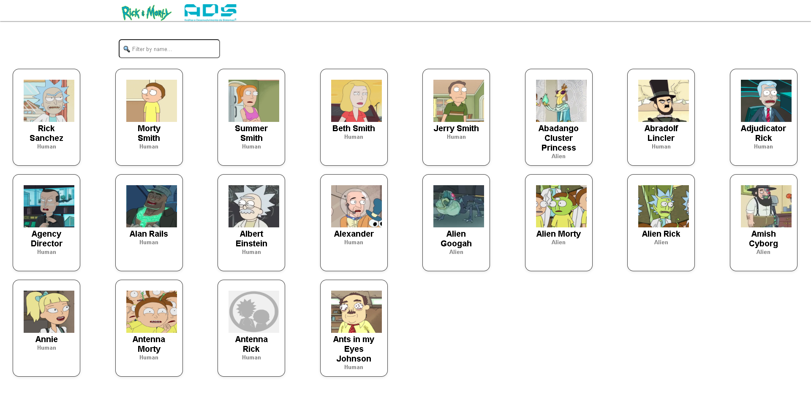
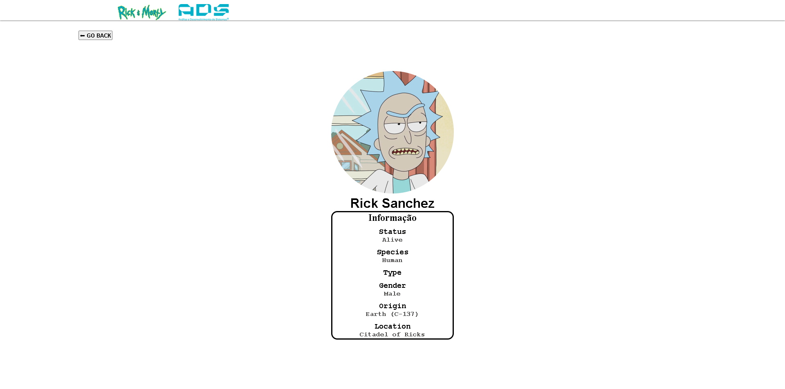

# 🚀 Rick And Morty


## 🖼️ Demonstração





Você pode acessar o projeto online clicando no link abaixo:  
🔗 https://marciowsz.github.io/rick-and-morty/


## 🛠️ Tecnologias Utilizadas

- HTML5
- CSS3 (Flexbox, Grid)
- JAVASCRIPT

## 👨🏻‍🚀 Sobre
"Conexão"
<table>
  <tbody>
    <tr>
      <td align="center" valign="top" width="14.28%"><a href="https://www.linkedin.com/in/marcioreisfreire/"><br /><sub><b>Marcio Freire</b></sub></a><br />
    </tr>
  </tbody>
</table>


## 📁 Como baixar e rodar o projeto

```bash
# Clone o repositório
git clone https://github.com/marciowsz/rick-and-morty.git

# Acesse a pasta do projeto
cd rick-and-morty

# Abra o arquivo index.html no seu navegador
